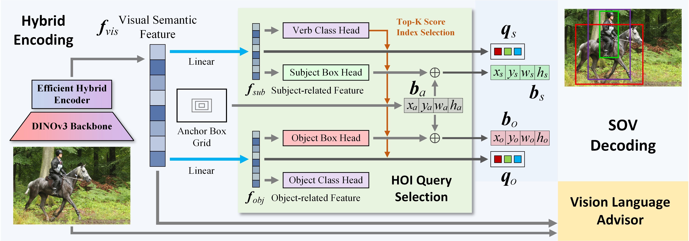

# Hybrid-SOV

Bridging Detection Architectures With Foundation Models: A Unified Framework for Human-Object Interaction Detection.

[[Paper]](https://ieeexplore.ieee.org/document/11367687)



## Requirements

```bash
conda create -n hybrid-sov python=3.10 -y
conda activate hybrid-sov
pip install uv

# Install PyTorch/torchvision for your CUDA version first.
# Example for CUDA 12.1:
uv pip install torch torchvision --index-url https://download.pytorch.org/whl/cu121

uv pip install numpy scipy pillow tqdm pyyaml pycocotools tabulate addict yapf loguru
uv pip install timm transformers fairscale omegaconf wandb
uv pip install git+https://github.com/openai/CLIP.git
uv pip install -U huggingface_hub
```

## Dataset Preparation

### HICO-DET

Please follow the HICO-DET dataset preparation of [GGNet](https://github.com/SherlockHolmes221/GGNet). See also the README of [QAHOI](https://github.com/cjw2021/QAHOI).

After preparation, the `data/hico_det` folder should look like:

```bash
data
+-- hico_det
|   +-- images
|   |   +-- test2015
|   |   +-- train2015
|   +-- annotations
|       +-- anno_list.json
|       +-- corre_hico.npy
|       +-- file_name_to_obj_cat.json
|       +-- hoi_id_to_num.json
|       +-- hoi_list_new.json
|       +-- test_hico.json
|       +-- trainval_hico.json
```

### V-COCO

Please follow the installation of [V-COCO](https://github.com/s-gupta/v-coco).

For evaluation, please put `vcoco_test.ids` and `vcoco_test.json` into the `data/v-coco/data` folder.

After preparation, the `data/v-coco` folder should look like:

```bash
data
+-- v-coco
|   +-- prior.pickle
|   +-- images
|   |   +-- train2014
|   |   +-- val2014
|   +-- data
|   |   +-- instances_vcoco_all_2014.json
|   |   +-- vcoco_test.ids
|   |   +-- vcoco_test.json
|   +-- annotations
|       +-- corre_vcoco.npy
|       +-- test_vcoco.json
|       +-- trainval_vcoco.json
```

## Model Weights

All released weights are hosted on Hugging Face at [thxplz/Hybrid-SOV](https://huggingface.co/thxplz/Hybrid-SOV). The checkpoint files are under the `params/` folder in the Hugging Face repository.

Download the released weights into the local `params` folder:

```bash
huggingface-cli download thxplz/Hybrid-SOV \
  --include "params/*" \
  --local-dir .
```

Expected files include:

```bash
params
+-- hico_det_hybrid-sov-r50.pth
+-- hico_det_hybrid-sov-vla-r50.pth
+-- rtdetr_r50vd_6x_coco_from_paddle_converted_hico.pth
+-- rtdetr_r50vd_6x_coco_from_paddle_converted_vcoco.pth
+-- vcoco-hybrid-sov-vla-r50.pth
```

## Evaluation

### HICO-DET

| Model | Full (def) | Rare (def) | None-Rare (def) | Full (ko) | Rare (ko) | None-Rare (ko) | ckpt |
|:---:|:---:|:---:|:---:|:---:|:---:|:---:|:---:|
| Hybrid-SOV-R50 | 35.58 | 31.65 | 36.76 | 39.04 | 35.36 | 40.13 | [checkpoint](https://huggingface.co/thxplz/Hybrid-SOV/blob/main/params/hico_det_hybrid-sov-r50.pth) |
| Hybrid-SOV-VLA-R50 | 43.10 | 43.04 | 43.12 | 46.02 | 46.14 | 45.98 | [checkpoint](https://huggingface.co/thxplz/Hybrid-SOV/blob/main/params/hico_det_hybrid-sov-vla-r50.pth) |
| Hybrid-SOV-VLA-DINOv3-CNX-L | 46.89 | 47.67 | 46.66 | 49.16 | 50.17 | 48.86 | [checkpoint](https://huggingface.co/thxplz/Hybrid-SOV/blob/main/params/hico_det_hybrid-sov-vla-dinov3-cnx-l.pth) |


Evaluate the released checkpoints by running:

```bash
# Hybrid-SOV-R50 (HICO-DET)
sh run/hybrid-sov-r50_eval.sh

# Hybrid-SOV-VLA-R50 (HICO-DET)
sh run/hybrid-sov-vla-r50_eval.sh
```

### V-COCO

| Model | AP (S1) | AP (S2) | ckpt |
|:---:|:---:|:---:|:---:|
| Hybrid-SOV-VLA-R50 | 67.9 | 70.1 | [checkpoint](https://huggingface.co/thxplz/Hybrid-SOV/blob/main/params/vcoco-hybrid-sov-vla-r50.pth) |

Evaluate the released checkpoint by running:

```bash
# Hybrid-SOV-VLA-R50 (V-COCO)
sh run/vcoco-hybrid-sov-vla-r50_eval.sh
```

## Training

### HICO-DET

Download the RT-DETR R50 HICO pre-trained weight from [thxplz/Hybrid-SOV](https://huggingface.co/thxplz/Hybrid-SOV/tree/main/params) into `params`:

```bash
params/rtdetr_r50vd_6x_coco_from_paddle_converted_hico.pth
```

Train Hybrid-SOV-R50:

```bash
sh run/hybrid-sov-r50.sh
```

Train Hybrid-SOV-VLA-R50:

```bash
sh run/hybrid-sov-vla-r50.sh
```

Train Hybrid-SOV-VLA with DINOv3/ConvNeXt-L:

```bash
sh run/hybrid-sov-vla-dinov3-cnx-l.sh
```

### V-COCO

Download the RT-DETR R50 V-COCO pre-trained weight from [thxplz/Hybrid-SOV](https://huggingface.co/thxplz/Hybrid-SOV/tree/main/params) into `params`:

```bash
params/rtdetr_r50vd_6x_coco_from_paddle_converted_vcoco.pth
```

Train Hybrid-SOV-VLA-R50 on V-COCO:

```bash
sh run/vcoco-hybrid-sov-vla-r50_hoi.sh
```

## References

```txt
@ARTICLE{chen2026hybridsov,
  author={Chen, Junwen and Yanai, Keiji},
  journal={IEEE Access}, 
  title={Bridging Detection Architectures With Foundation Models: A Unified Framework for Human-Object Interaction Detection}, 
  year={2026},
  volume={14},
  pages={23299-23310},
  url={https://ieeexplore.ieee.org/document/11367687}
}
```
